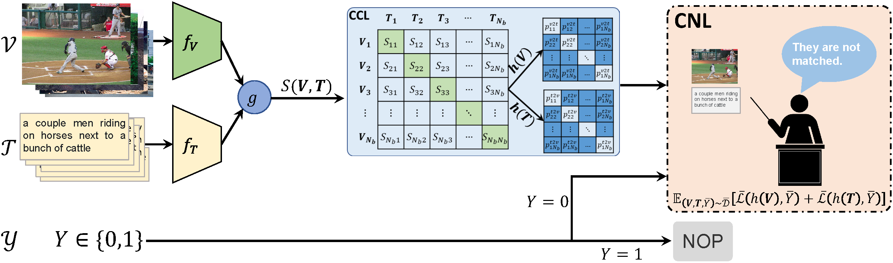
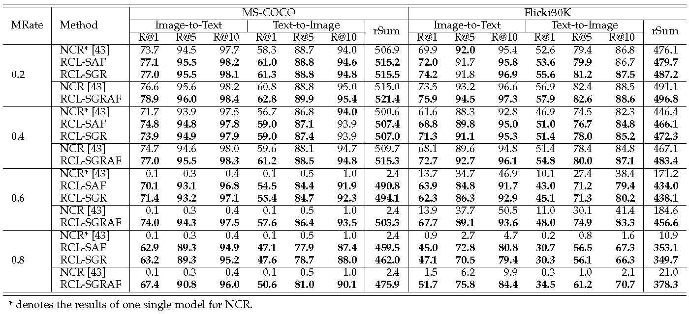
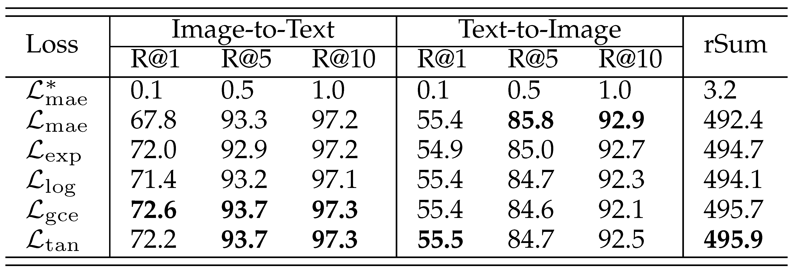
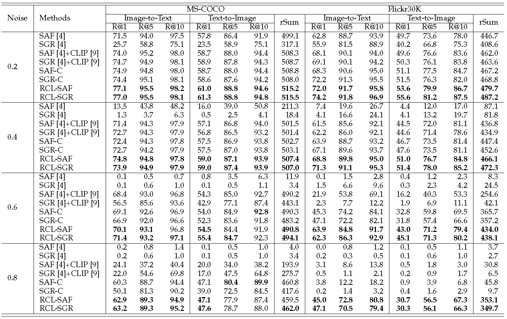

# RCL-SGRAF
*PyTorch implementation for IEEE TPAMI 2023 paper of [**“Cross-Modal Retrieval with Partially Mismatched Pairs”**](https://doi.org/10.1109/TPAMI.2023.3247939).* 

*It is built on top of the [SCAN](https://github.com/kuanghuei/SCAN) and [SGRAF](https://github.com/Paranioar/SGRAF).* 

<!-- *We have released two versions of SGRAF: **Branch `main` for python2.7**; **Branch `python3.6` for python3.6**.*  -->

## Introduction

**The framework of RCL:**



**The framework of SGRAF:**


## Partial experimental results
**TABLE 5: Comparison with NCR [43] under different mismatching rates (MRate) on MS-COCO and Flickr30K.**


**TABLE 6: Comparison of SGR [5] with different presented loss functions under the mismatching rates (MRate) of 0.6 on MS-COCO.**




**TABLE 8: Comparison with filtering-based baselines under different mismatching rates (MRate) on MS-COCO 1K and
Flickr30K.**


## Requirements 
We recommended the following dependencies for ***Branch `main`***.

*  python 3.6
*  [PyTorch (>=0.4.1)](http://pytorch.org/)    
*  [NumPy (>=1.12.1)](http://www.numpy.org/)   
*  [TensorBoard](https://github.com/TeamHG-Memex/tensorboard_logger)  
*  Punkt Sentence Tokenizer:
```python
import nltk
nltk.download()
> d punkt
```

## Download data and vocab
We follow [SCAN](https://github.com/kuanghuei/SCAN) to obtain image features and vocabularies, which can be downloaded by using:

```bash
wget https://scanproject.blob.core.windows.net/scan-data/data.zip
wget https://scanproject.blob.core.windows.net/scan-data/vocab.zip
```

## Training new models from scratch
Modify the **data_path**, **vocab_path**, **model_name**, **logger_name** in the `opts.py` file. Then run `train.py`:

For MSCOCO:
```bash
# For SGR
python train.py --data_name coco_precomp --num_epochs 20 --lr_update 10 --module_name SGR

# For SAF
python train.py --data_name coco_precomp --num_epochs 20 --lr_update 10 --module_name SAF
```

For Flickr30K:
```bash
# For SGR
python train.py --data_name f30k_precomp --num_epochs 40 --lr_update 30 --module_name SGR

# For SAF
python train.py --data_name f30k_precomp --num_epochs 30 --lr_update 20 --module_name SAF
```

## Pre-trained models and evaluation
For Flickr30K:
```bash
# For SGR
python evaluate_model.py --data_name f30k_precomp --module_name SGR

# For SAF
python evaluate_model.py --data_name f30k_precomp --module_name SAF

# For SGRAF
python evaluate_model.py --data_name f30k_precomp --module_name SGRAF
```

## Reference

If RCL is useful for your research, please cite the following paper:

    @article{hu2023cross,
        author={Hu, Peng and Huang, Zhenyu and Peng, Dezhong and Wang, Xu and Peng, Xi},
          journal={IEEE Transactions on Pattern Analysis and Machine Intelligence}, 
          title={Cross-Modal Retrieval with Partially Mismatched Pairs}, 
          year={2023},
          volume={},
          number={},
          pages={1-15},
          doi={10.1109/TPAMI.2023.3247939}
     }

## License

[Apache License 2.0](http://www.apache.org/licenses/LICENSE-2.0).  
If any problems, please contact me at (penghu.ml@gmail.com)


