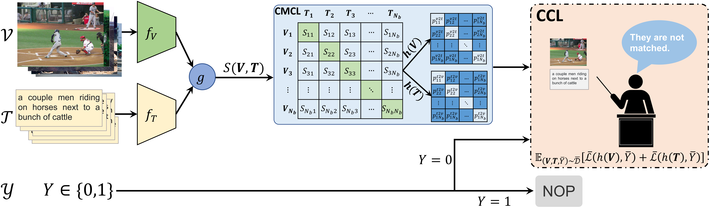
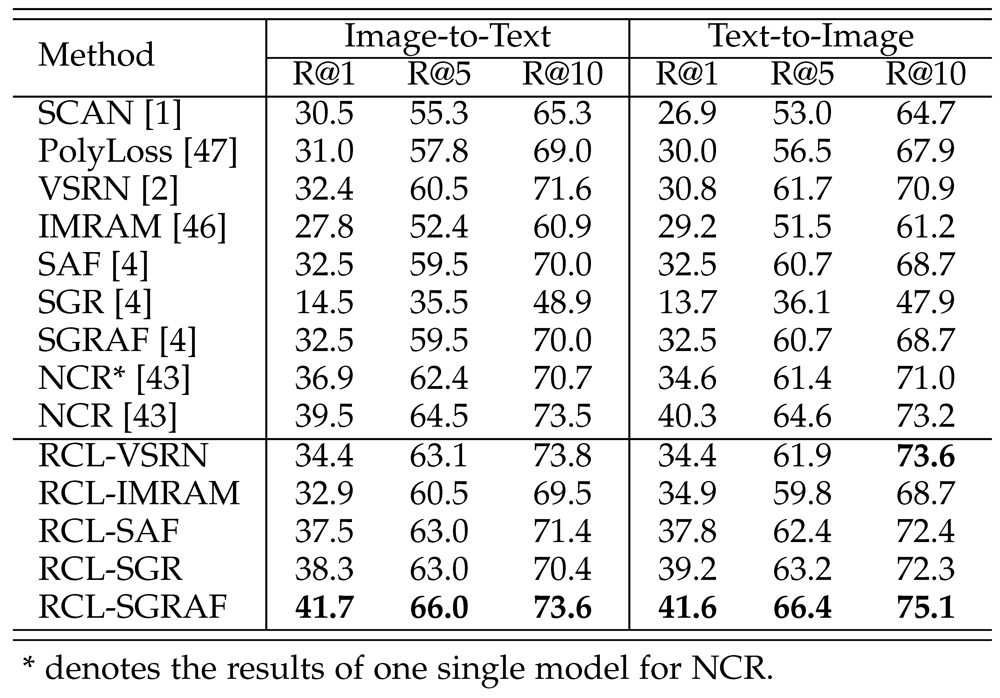
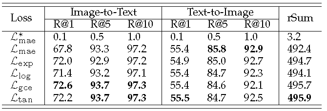

# RCL-SGRAF
*PyTorch implementation for IEEE TPAMI 2023 paper of [**“Cross-Modal Retrieval with Partially Mismatched Pairs”**](https://doi.org/10.1109/TPAMI.2023.3247939).* 

*It is built on top of the [SCAN](https://github.com/kuanghuei/SCAN) and [SGRAF](https://github.com/Paranioar/SGRAF).* 

<!-- *We have released two versions of SGRAF: **Branch `main` for python2.7**; **Branch `python3.6` for python3.6**.*  -->

## Introduction

**The framework of RCL:**


**CCL:**
```python
class CCL(nn.Module):
    """
    Compute contrastive loss
    """
    def __init__(self, tau=0.05, method='log', q=0.5, ratio=0):
        super(CCL, self).__init__()
        self.tau = tau
        self.method = method
        self.q = q
        self.ratio = ratio

    def forward(self, scores):
        eps = 1e-10
        scores = (scores / self.tau).exp()
        i2t = scores / (scores.sum(1, keepdim=True) + eps)
        t2i = scores.t() / (scores.t().sum(1, keepdim=True) + eps)

        randn, eye = torch.rand_like(scores), torch.eye(scores.shape[0]).cuda()
        randn[eye > 0] = randn.min(dim=1)[0] - 1
        n = scores.shape[0]
        num = n - 1 if self.ratio <= 0 or self.ratio >= 1 else int(self.ratio * n)
        V, K = randn.topk(num, dim=1)
        mask = torch.zeros_like(scores)
        mask[torch.arange(n).reshape([-1, 1]).cuda(), K] = 1.

        if self.method == 'log':
            criterion = lambda x: -((1. - x + eps).log() * mask).sum(1).mean()
        elif self.method == 'tan':
            criterion = lambda x: (x.tan() * mask).sum(1).mean()
        elif self.method == 'abs':
            criterion = lambda x: (x * mask).sum(1).mean()
        elif self.method == 'exp':
            criterion = lambda x: ((-(1. - x)).exp() * mask).sum(1).mean()
        elif self.method == 'gce':
            criterion = lambda x: ((1. - (1. - x + eps) ** self.q) / self.q * mask).sum(1).mean()
        elif self.method == 'infoNCE':
            criterion = lambda x: -x.diag().log().mean()
        else:
            raise Exception('Unknown Loss Function!')
        return criterion(i2t) + criterion(t2i)
```

## Experimental results
**TABLE 2: Image-text matching with different mismatching rates (MRate) on MS-COCO 1K and Flickr30K.**


**TABLE 3: Video-text retrieval with different mismatching rates (MRate) on MSVD and MSR-VTT.**


**TABLE 4: Image-text matching on CC152K.**



**TABLE 5: Comparison with NCR [43] under different mismatching rates (MRate) on MS-COCO and Flickr30K.**


**TABLE 6: Comparison of SGR [5] with different presented loss functions under the mismatching rates (MRate) of 0.6 on MS-COCO.**




**TABLE 8: Comparison with filtering-based baselines under different mismatching rates (MRate) on MS-COCO 1K and
Flickr30K.**


## Download data and vocab
We follow [SCAN](https://github.com/kuanghuei/SCAN) to obtain image features and vocabularies, which can be downloaded by using:

```bash
wget https://scanproject.blob.core.windows.net/scan-data/data.zip
wget https://scanproject.blob.core.windows.net/scan-data/vocab.zip
```

## Reference

If RCL is useful for your research, please cite the following paper:

    @article{hu2023cross,
        author={Hu, Peng and Huang, Zhenyu and Peng, Dezhong and Wang, Xu and Peng, Xi},
          journal={IEEE Transactions on Pattern Analysis and Machine Intelligence}, 
          title={Cross-Modal Retrieval with Partially Mismatched Pairs}, 
          year={2023},
          volume={},
          number={},
          pages={1-15},
          doi={10.1109/TPAMI.2023.3247939}
     }

## License

[Apache License 2.0](http://www.apache.org/licenses/LICENSE-2.0).  
If any problems, please contact me at (penghu.ml@gmail.com)


